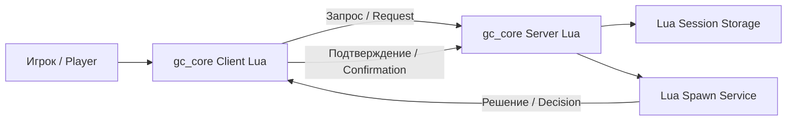

# Архитектура / Architecture

## Диаграмма / Diagram



## Объяснение RU

- **Игрок** подключается к FiveM-серверу.
- **Клиент** (`gc_core Client Lua`) запускается на стороне игрока.
- **Сервер** (`gc_core Server Lua`) обрабатывает запросы.
- **Сессии** хранятся в оперативной памяти сервера.
- **Спавн** создаёт решение о появлении игрока.
- Клиент выполняет спавн и подтверждает результат.

## Explanation EN

- The **Player** connects to the FiveM server.
- The **Client** (`gc_core Client Lua`) runs on the player side.
- The **Server** (`gc_core Server Lua`) processes requests.
- **Sessions** are stored in the server memory.
- The **Spawn** service creates a spawn decision.
- The client performs the spawn and confirms the result.

## ASCII-схема / ASCII diagram

```text
Игрок / Player
    ↓
gc_core Client Lua
    ↓  Запрос / Request
gc_core Server Lua
    ↓
Lua Session Storage
    ↓
Lua Spawn Service
    ↓  Решение / Decision
gc_core Client Lua
    ↓  Подтверждение / Confirmation
gc_core Server Lua
```
