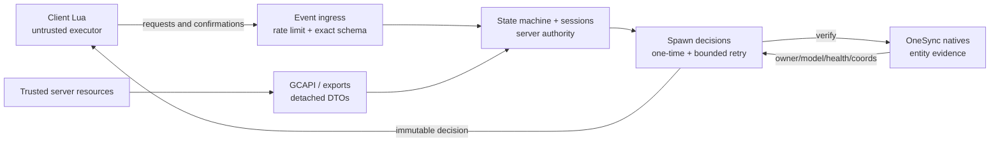

# Архитектура / Architecture

Shared runtime/version/event/validation modules are loaded on both sides, while
side-specific bootstraps assert context through `GCRuntime`. All production state
changes are routed through `GCStates.Set`.
