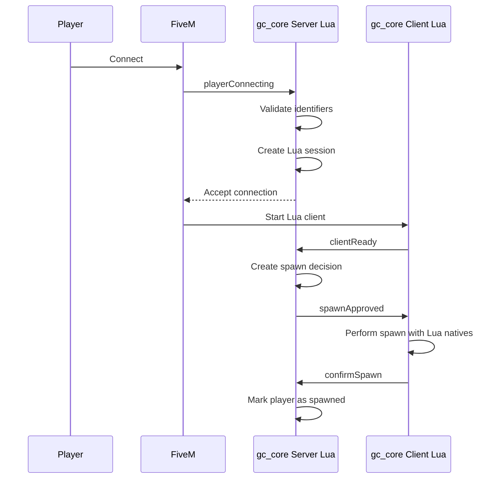

# Поток подключения / Connection Flow

## Диаграмма / Diagram



## Объяснение RU

1. Игрок подключается к FiveM.
2. FiveM вызывает событие `playerConnecting`.
3. Сервер проверяет идентификаторы.
4. Сервер создаёт Lua-сессию.
5. Сервер разрешает подключение.
6. FiveM запускает клиентский Lua-код.
7. Клиент сообщает о готовности (`clientReady`).
8. Сервер создаёт решение о спавне.
9. Сервер отправляет решение клиенту (`spawnApproved`).
10. Клиент выполняет спавн через natives.
11. Клиент подтверждает спавн (`confirmSpawn`).
12. Сервер помечает игрока как появившегося.

## Explanation EN

1. The player connects to FiveM.
2. FiveM fires the `playerConnecting` event.
3. The server validates the identifiers.
4. The server creates a Lua session.
5. The server accepts the connection.
6. FiveM starts the client Lua code.
7. The client reports readiness (`clientReady`).
8. The server creates a spawn decision.
9. The server sends the decision to the client (`spawnApproved`).
10. The client performs the spawn through natives.
11. The client confirms the spawn (`confirmSpawn`).
12. The server marks the player as spawned.

## ASCII-схема / ASCII diagram

```text
Игрок / Player
    ↓
FiveM
    ↓  playerConnecting
gc_core Server Lua
    ↓  Проверка / Validation
    ↓  Создание сессии / Session creation
    ↓  Разрешение / Accept
FiveM
    ↓  Запуск клиента / Client start
gc_core Client Lua
    ↓  clientReady
gc_core Server Lua
    ↓  Создание решения / Decision creation
    ↓  spawnApproved
gc_core Client Lua
    ↓  Спавн / Spawn
    ↓  confirmSpawn
gc_core Server Lua
    ↓  Игрок появился / Player spawned
```
