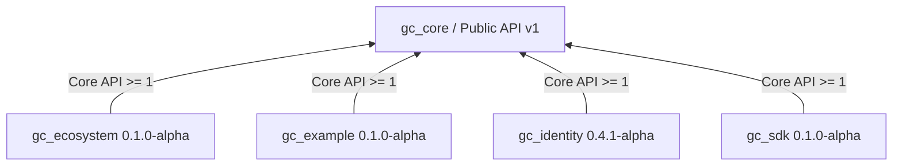

<!-- THIS FILE IS GENERATED. DO NOT EDIT MANUALLY. -->
# GCore module dependency graph

```mermaid
flowchart BT
    gc_core["gc_core / Public API v1"]
    gc_ecosystem["gc_ecosystem 0.1.0-alpha"]
    gc_ecosystem -->|"Core API >= 1"| gc_core
    gc_example["gc_example 0.1.0-alpha"]
    gc_example -->|"Core API >= 1"| gc_core
    gc_identity["gc_identity 0.4.1-alpha"]
    gc_identity -->|"Core API >= 1"| gc_core
    gc_sdk["gc_sdk 0.1.0-alpha"]
    gc_sdk -->|"Core API >= 1"| gc_core
```
