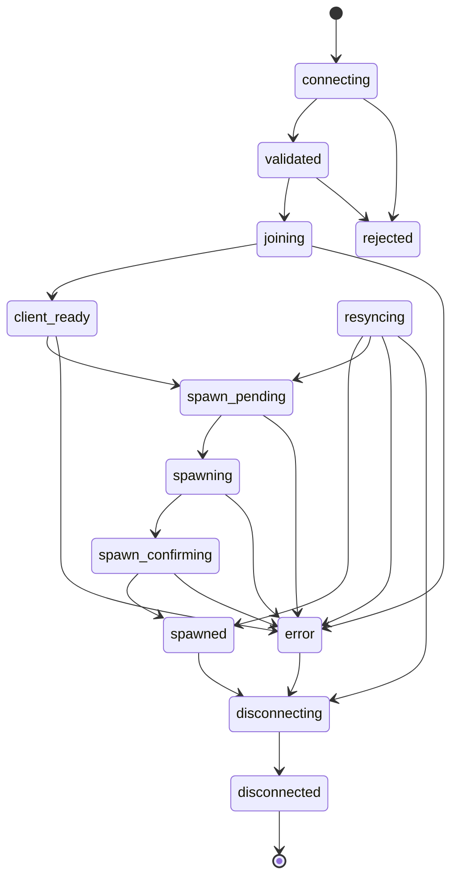

# Жизненный цикл игрока / Player Lifecycle

## Диаграмма / Diagram



## Объяснение RU

- **connecting**: игрок подключается.
- **validated**: проверка завершена.
- **joining**: игрок входит.
- **client_ready**: клиент готов.
- **spawn_pending**: спавн подготавливается.
- **spawning**: выполняется спавн.
- **spawn_confirming**: сервер ожидает подтверждение спавна.
- **spawned**: игрок появился.
- **resyncing**: сервер восстанавливает сессию после рестарта ресурса.
- **disconnecting**: игрок отключается.
- **disconnected**: игрок отключён.
- **rejected**: подключение отклонено.
- **error**: произошла ошибка.

## Explanation EN

- **connecting**: the player is connecting.
- **validated**: validation completed.
- **joining**: the player is joining.
- **client_ready**: the client is ready.
- **spawn_pending**: spawn is being prepared.
- **spawning**: spawn is in progress.
- **spawn_confirming**: the server waits for spawn confirmation.
- **spawned**: the player has spawned.
- **resyncing**: the server is recovering a session after a resource restart.
- **disconnecting**: the player is disconnecting.
- **disconnected**: the player disconnected.
- **rejected**: connection rejected.
- **error**: an error occurred.

## ASCII-схема / ASCII diagram

```text
[*] → connecting → validated → joining → client_ready
      → spawn_pending → spawning → spawn_confirming → spawned
      → disconnecting → disconnected → [*]

connecting → rejected
validated → rejected
joining → error
client_ready → error
spawn_pending → error
spawning → error
spawn_confirming → error
error → disconnecting

resource restart → resyncing → spawned | spawn_pending | error | disconnecting
```
