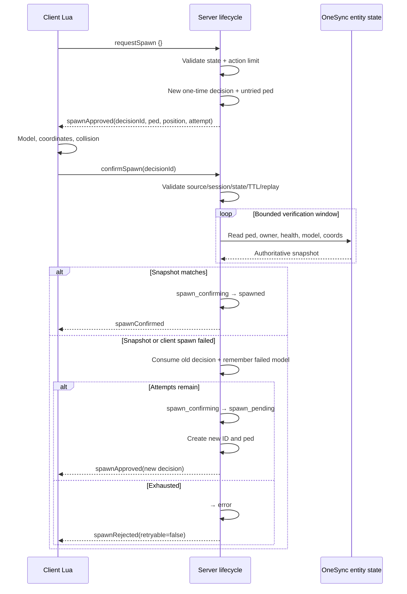

# Поток спавна / Spawn flow

The client confirmation is only a request to verify. The server does not enter
`spawned` until the OneSync snapshot matches the immutable decision. Every retry
invalidates the old ID; decision IDs are correlation values, not credentials.
