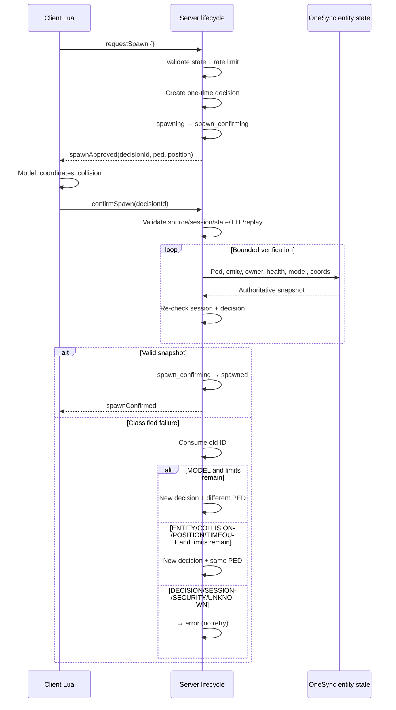

# Поток спавна / Spawn flow

```mermaid
sequenceDiagram
    participant C as Client Lua
    participant S as Server lifecycle
    participant O as OneSync entity state

    C->>S: requestSpawn {}
    S->>S: Validate state + rate limit
    S->>S: Create one-time decision
    S->>S: spawning → spawn_confirming
    S-->>C: spawnApproved(decisionId, ped, position)
    C->>C: Model, coordinates, collision
    C->>S: confirmSpawn(decisionId)
    S->>S: Validate source/session/state/TTL/replay
    loop Bounded verification
        S->>O: Ped, entity, owner, health, model, coords
        O-->>S: Authoritative snapshot
        S->>S: Re-check session + decision
    end
    alt Valid snapshot
        S->>S: spawn_confirming → spawned
        S-->>C: spawnConfirmed
    else Classified failure
        S->>S: Consume old ID
        alt MODEL and limits remain
            S->>S: New decision + different PED
        else ENTITY/COLLISION/POSITION/TIMEOUT and limits remain
            S->>S: New decision + same PED
        else DECISION/SESSION/SECURITY/UNKNOWN
            S->>S: → error (no retry)
        end
    end
```

Client confirmation is only a verification request. Every retry is bounded and
cancelable; only MODEL failures exclude the current PED.
