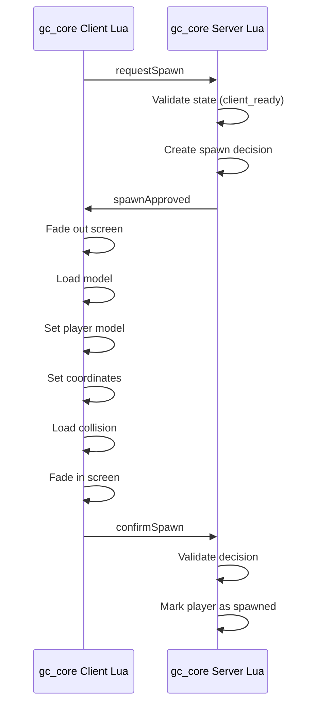

# Поток спавна / Spawn Flow

## Диаграмма / Diagram



## Объяснение RU

1. Клиент запрашивает спавн (`requestSpawn`).
2. Сервер проверяет состояние игрока (`client_ready`).
3. Сервер создаёт решение о спавне.
4. Сервер отправляет решение клиенту (`spawnApproved`).
5. Клиент затемняет экран.
6. Клиент загружает модель.
7. Клиент устанавливает модель игрока.
8. Клиент устанавливает координаты.
9. Клиент загружает коллизию.
10. Клиент возвращает изображение.
11. Клиент подтверждает спавн (`confirmSpawn`).
12. Сервер проверяет решение.
13. Сервер помечает игрока как появившегося.

## Explanation EN

1. The client requests a spawn (`requestSpawn`).
2. The server validates the player state (`client_ready`).
3. The server creates a spawn decision.
4. The server sends the decision to the client (`spawnApproved`).
5. The client fades out the screen.
6. The client loads the model.
7. The client sets the player model.
8. The client sets the coordinates.
9. The client loads the collision.
10. The client restores the image.
11. The client confirms the spawn (`confirmSpawn`).
12. The server validates the decision.
13. The server marks the player as spawned.

## ASCII-схема / ASCII diagram

```text
gc_core Client Lua
    ↓  requestSpawn
gc_core Server Lua
    ↓  Проверка состояния / State validation
    ↓  Создание решения / Decision creation
    ↓  spawnApproved
gc_core Client Lua
    ↓  Затемнение / Fade out
    ↓  Загрузка модели / Model load
    ↓  Установка модели / Model set
    ↓  Установка координат / Coordinates set
    ↓  Загрузка коллизии / Collision load
    ↓  Возврат изображения / Fade in
    ↓  confirmSpawn
gc_core Server Lua
    ↓  Проверка решения / Decision validation
    ↓  Игрок появился / Player spawned