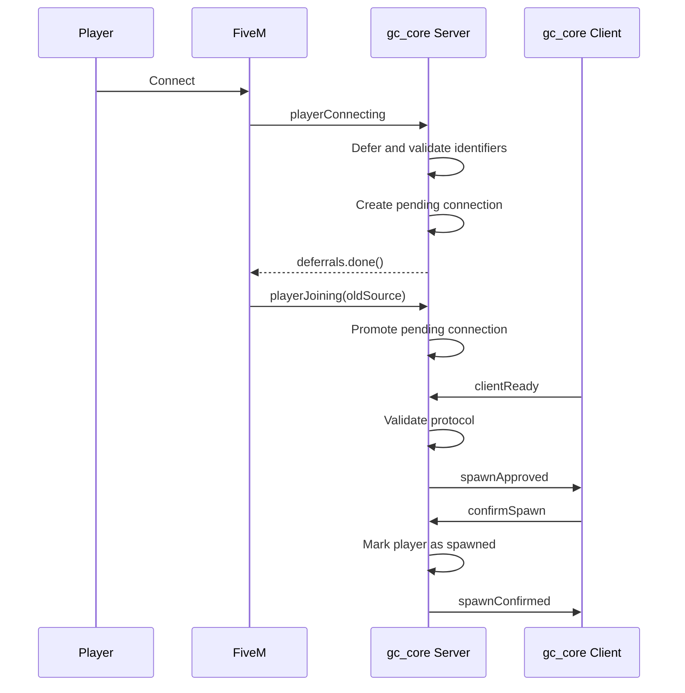

# Connection Flow / Поток подключения

## Level 1. In simple words

When a player connects, GreenCore validates the connection before allowing the
player into the server. Invalid connections receive a localized error.

## Level 2. Technical explanation

GreenCore follows the required `playerConnecting` deferral lifecycle:

```text
deferrals.defer()
   ↓
Wait(0)
   ↓
deferrals.update(...)
   ↓
Wait(0)
   ↓
Validation
   ↓
deferrals.done()
```

The `source` used during `playerConnecting` is temporary. GreenCore therefore
creates a pending connection, not an active player session. After FiveM emits
`playerJoining`, the pending record is promoted to an active session keyed by
the final runtime source:

```text
playerConnecting (temporary source = 60000)
   ↓
PendingConnection[60000]
   ↓
playerJoining(oldSource = "60000", final source = 12)
   ↓
PendingConnection[60000] → ActiveSession[12]
```

FiveM supplies `oldSource` as a string. GreenCore normalizes it to a number
before looking up and promoting the pending connection.

## Sequence



## Validation

The server validates the source, player name, identifiers, required license
(when enabled), duplicate connections, deferral timeout, resource state, and
whether new connections are currently blocked.

Pending connections expire after
`GCConfig.Connection.pendingConnectionLifetimeMs`. Active sessions waiting for
`clientReady` are also protected by the server-side
`GCConfig.Connection.clientReadyTimeoutMs` timeout.

## Handlers

```lua
AddEventHandler('playerConnecting', function(playerName, setKickReason, deferrals)
    GCConnection.HandleConnecting(playerName, setKickReason, deferrals)
end)

AddEventHandler('playerJoining', function(oldSource)
    GCConnection.HandleJoining(oldSource)
end)
```

## Next step

Go to [Player Session](05-player-session.md).
