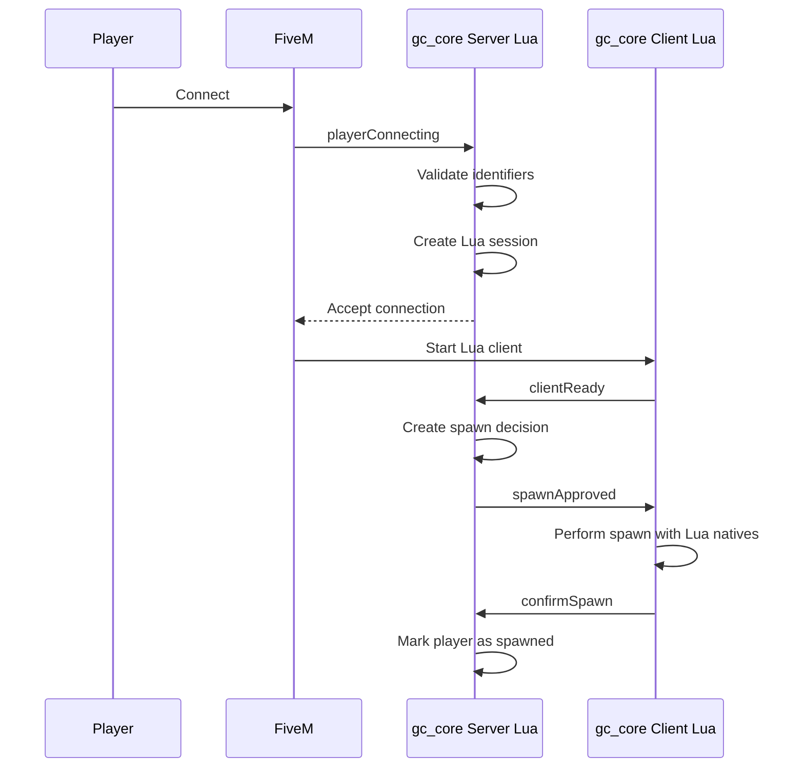

# Connection Flow / Поток подключения

## Level 1. In simple words

When a player connects to the server, GreenCore validates their data.
If everything is fine, the player joins the server.
If not, the player receives an error message.

## Level 2. Technical explanation

GreenCore uses the `playerConnecting` event and deferrals.
Deferrals allow delaying the connection decision until validation completes.

## Level 3. Diagram



## Level 4. Validations

On connection, the server validates:

1. The `source` correctness.
2. The player name existence.
3. The name is not empty.
4. The name length.
5. The identifiers presence.
6. The mandatory `license` presence.
7. The `license2` fallback availability.
8. The absence of a duplicate connection.
9. The absence of a stuck old connection.
10. The timeout is not exceeded.
11. The resource is not stopping.
12. The connections are not blocked.

## Handler code

```lua
AddEventHandler('playerConnecting', function(playerName, setKickReason, deferrals)
    GCConnection.HandleConnecting(playerName, setKickReason, deferrals)
end)
```

## Next step

Go to [Player Session](05-player-session.md).