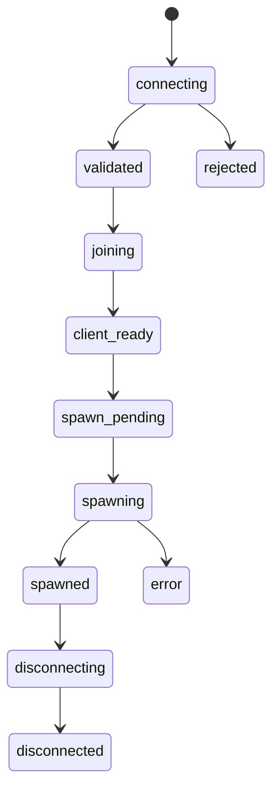

# Player States / Состояния игрока

## Level 1. In simple words

A state is the stage a player is at.
GreenCore ensures the player passes stages in the correct order.

## Level 2. Technical explanation

Each state is stored in the player session.
Transitions between states are validated by the server.

## State table

| State           | RU                     | EN                      |
| --------------- | ---------------------- | ----------------------- |
| `connecting`    | Игрок подключается     | Player is connecting    |
| `validated`     | Проверка завершена     | Validation completed    |
| `joining`       | Игрок входит           | Player is joining       |
| `client_ready`  | Клиент готов           | Client is ready         |
| `spawn_pending` | Спавн подготавливается | Spawn is being prepared |
| `spawning`      | Выполняется спавн      | Spawn is in progress    |
| `spawned`       | Игрок появился         | Player has spawned      |
| `disconnecting` | Игрок отключается      | Player is disconnecting |
| `disconnected`  | Игрок отключён         | Player disconnected     |
| `rejected`      | Подключение отклонено  | Connection rejected     |
| `error`         | Произошла ошибка       | An error occurred       |

## Allowed transitions

```text
connecting → validated
validated → joining
joining → client_ready
client_ready → spawn_pending
spawn_pending → spawning
spawning → spawned
spawned → disconnecting
disconnecting → disconnected
```

## Additional transitions

```text
connecting → rejected
validated → rejected
joining → error
client_ready → error
spawn_pending → error
spawning → error
error → disconnecting
```

## Forbidden transitions

```text
connecting → spawned
validated → spawned
client_ready → connecting
spawned → spawn_pending
disconnected → spawned
```

## Diagram



## State service methods

| Method | Purpose |
| ------ | ------- |
| `GCStates.CanTransition` | Checks whether a transition is allowed |
| `GCStates.Set` | Sets a new state |
| `GCStates.Get` | Returns the current state |
| `GCStates.Is` | Checks whether a player is in a state |
| `GCStates.GetAllowedTransitions` | Returns allowed transitions |

## Level 3. Lua code example

```lua
local success, errorCode = GCStates.Set(
    playerSource,
    'client_ready',
    'client_reported_ready'
)

if not success then
    print('State transition failed: ' .. tostring(errorCode))
end
```

## Next step

Go to [Spawn Flow](07-spawn-flow.md).