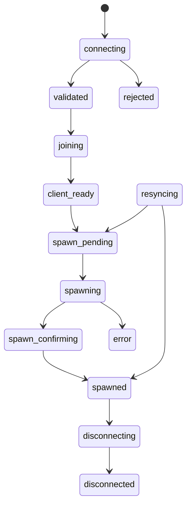

# Player States / Состояния игрока

## Overview

Every player session has a server-controlled state. `GCStates.Set` validates
each transition and returns `success, errorCode`; callers must handle failures.

## States

| State | Purpose |
| ----- | ------- |
| `connecting` | The connection is being validated |
| `validated` | Validation completed |
| `joining` | FiveM is finalizing the join |
| `client_ready` | Client protocol readiness is confirmed |
| `spawn_pending` | The server is preparing a spawn |
| `spawning` | The client spawn is in progress |
| `spawn_confirming` | The server is waiting for spawn confirmation |
| `spawned` | The player has spawned |
| `resyncing` | A session is resynchronizing after resource restart |
| `disconnecting` | Disconnect cleanup is in progress |
| `disconnected` | Disconnect cleanup completed |
| `rejected` | The connection was rejected |
| `error` | A terminal operation failed |

## Main lifecycle

```text
connecting → validated → joining → client_ready → spawn_pending
           → spawning → spawn_confirming → spawned
```

Recovered sessions use one of these transitions:

```text
resyncing → spawned
resyncing → spawn_pending
```

Every active state can transition to `disconnecting`, followed by
`disconnecting → disconnected`. Error transitions are allowed from `joining`,
`client_ready`, all spawn states, and `resyncing`.

## Diagram



## State service

| Method | Purpose |
| ------ | ------- |
| `GCStates.CanTransition` | Checks whether a transition is allowed |
| `GCStates.Set` | Applies a validated transition |
| `GCStates.Get` | Returns the current state |
| `GCStates.Is` | Checks the current state |
| `GCStates.GetAllowedTransitions` | Returns allowed target states |
| `GCStates.IsActiveState` | Checks whether a state can still disconnect |

## Next step

Go to [Spawn Flow](07-spawn-flow.md).
