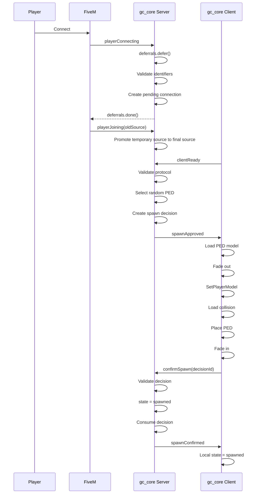

# Spawn Flow / Поток спавна

## Level 1. In simple words

When the client is ready, the **server** decides where and with which model the player spawns.
The server randomly picks a PED model from a whitelist.
The client performs the spawn but does NOT consider it complete by itself.
Only the server confirms the spawn (`spawnConfirmed`).

## Level 2. Technical explanation

1. The server picks the PED model via `GCPedProvider.Resolve`.
2. The server picks the location via `GCSpawnLocationProvider.Resolve`.
3. The server creates a `spawnDecision` containing `ped = { name, hash }`.
4. The client receives `spawnApproved`, loads the model, and performs the spawn.
5. The client moves to `spawn_confirming` and sends `confirmSpawn`.
6. The server validates the decision atomically and moves the player to `spawned`.
7. The server sends `spawnConfirmed`, and only then does the client set `spawned=true`.

## Diagram



## Server spawn decision

```lua
local spawnDecision = {
    id = 'gc:spawn:generated-id',
    sessionId = 'gc:session:generated-id',
    source = playerSource,

    position = {
        x = -1037.65,
        y = -2737.72,
        z = 20.17,
        heading = 329.0
    },

    ped = {
        name = 'a_m_y_business_01',
        hash = 0x...
    },

    createdAt = os.time(),
    expiresAt = os.time() + 30,

    confirmed = false,
    consumed = false
}
```

The decision is created **only by the server**, and the random PED is chosen exactly once.

The client cannot:

- choose coordinates;
- choose a PED model;
- create a Decision ID;
- extend the expiry time;
- confirm someone else's decision.

## Atomic confirmation

The confirmation order is strict:

```text
VALIDATE
   ↓
STATE TRANSITION (spawn_confirming → spawned)
   ↓
MARK DECISION CONFIRMED
   ↓
MARK DECISION CONSUMED
   ↓
REMOVE ACTIVE DECISION
   ↓
CLEAR session.spawnDecision
   ↓
SEND spawnConfirmed
```

If the state transition fails, the decision **stays active** for retry/timeout and is
not consumed prematurely.

## Client spawn

The client performs:

1. Receiving the server decision.
2. Validating the payload (`GCValidation.SpawnApproved`).
3. Fading out the screen with a timeout.
4. Validating the model: `IsModelInCdimage`, `IsModelValid`, `IsModelAPed`.
5. Loading the model with a timeout.
6. `SetPlayerModel`.
7. Re-acquiring the ped (the old handle is stale).
8. Setting the server-provided coordinates.
9. Loading the collision with a timeout.
10. Clearing the ped tasks.
11. Unfreezing the ped and restoring control.
12. Moving to `spawn_confirming` (NOT `spawned`).
13. Sending `confirmSpawn(decisionId)`.

The client **never** sets `spawned=true` by itself. Only the server does it through
the `spawnConfirmed` event.

## Used natives

```lua
IsModelInCdimage(modelHash)
IsModelValid(modelHash)
IsModelAPed(modelHash)
RequestModel(modelHash)
HasModelLoaded(modelHash)
SetPlayerModel(PlayerId(), modelHash)
SetModelAsNoLongerNeeded(modelHash)
SetEntityCoordsNoOffset(...)
SetEntityHeading(...)
RequestCollisionAtCoord(...)
HasCollisionLoadedAroundEntity(...)
FreezeEntityPosition(...)
DoScreenFadeOut(...)
DoScreenFadeIn(...)
```

## Random PED

See [Random PED Spawn](random-ped-spawn.md) for details.

## Next step

Go to [Configuration](08-configuration.md).