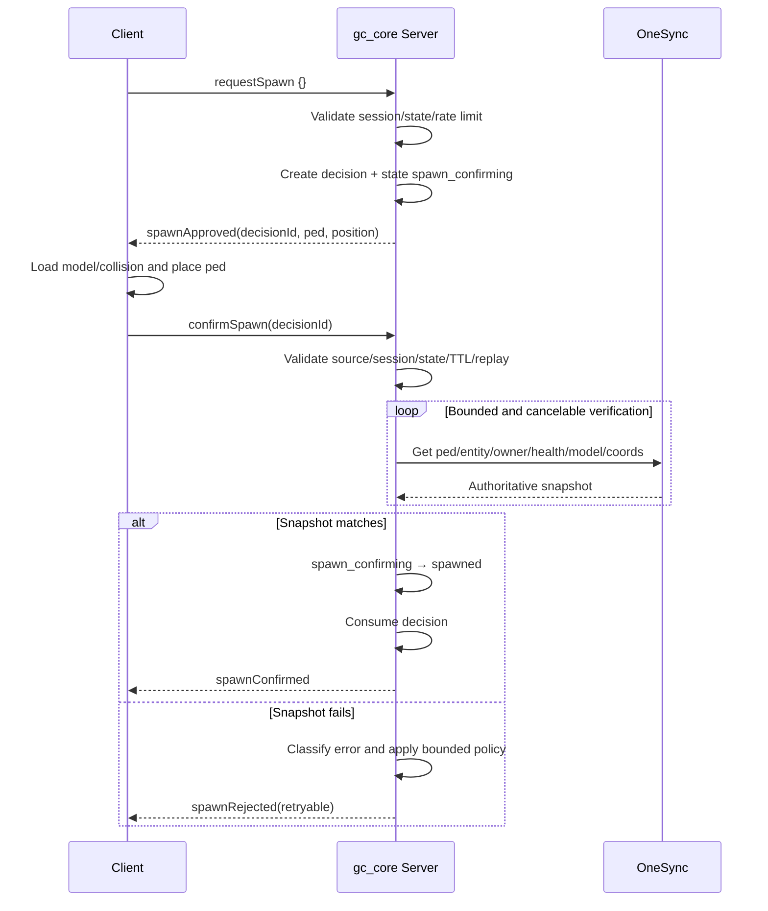

# Spawn flow

## In simple words

The client asks. The server validates, chooses the PED and coordinates, and
creates a one-time decision. The client executes it. The server then reads the
actual OneSync entity and only commits `spawned` if it matches the decision.

## Diagram



The internal `spawn_confirming` transition happens **before** `spawnApproved` is
sent, so an immediate client response cannot race an unfinished server state.

## Server verification

`confirmSpawn` carries only `decisionId`; it is not proof. Production
`GCSpawn.Confirm` checks:

1. decision exists and is not expired/consumed;
2. event source and session own the decision;
3. lifecycle is `spawn_confirming`;
4. `GetPlayerPed` and `DoesEntityExist`;
5. `NetworkGetEntityOwner(ped) == playerSource`;
6. `GetEntityHealth` meets the configured minimum;
7. `GetEntityModel` matches the server-selected PED;
8. `GetEntityCoords` is within tolerance of the decision;
9. the same session/decision still exists after the native boundary.

Verification stops when the player disconnects, the session/decision changes, the
decision expires, the resource stops, state changes, the attempt limit is reached,
or timeout expires.

## Retry policy

Every retry consumes the old ID and creates a new decision. The model changes only
for a MODEL failure.

| Category | Examples | Action |
| --- | --- | --- |
| MODEL | invalid/load timeout/model mismatch | new decision, different PED |
| ENTITY | missing/dead entity | limited new decision, same PED |
| COLLISION | collision timeout | limited same PED |
| POSITION | replication/mismatch | bounded verification, then limited same PED |
| VERIFICATION/TIMEOUT | snapshot/verification timeout | limited same PED |
| DECISION | unknown/expired/consumed/source mismatch | reject; no spawn retry |
| SESSION | session mismatch/change/state error | reject; cancel transaction |
| SECURITY | wrong network owner | reject and security log |
| UNKNOWN | unregistered code | fail closed |

Limits are `maxTotalAttempts`, `maxSamePedRetries`, `maxDifferentPedRetries`, and
`verification.maxAttempts` in `config/spawn.lua`. No per-player frame loop exists.

## Client execution example

```lua
-- The client executes only the immutable server payload.
TriggerServerEvent('gc_core:server:confirmSpawn', {
    decisionId = payload.decisionId
})
```

Client coordinates, PED model, alive state, and confirmation are never accepted as
authoritative truth.

Continue with [configuration](08-configuration.md).
