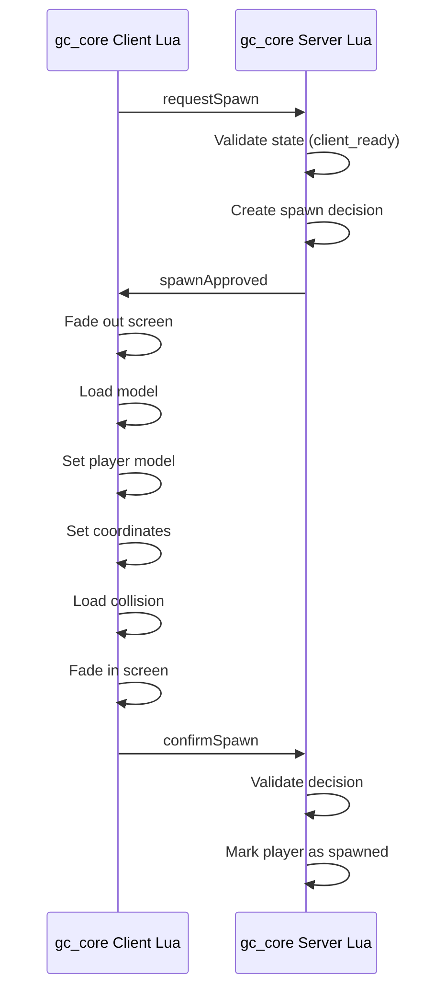

# Spawn Flow / Поток спавна

## Level 1. In simple words

When the client is ready, the server decides where and with which model the player spawns.
The client performs the spawn and reports the result to the server.

## Level 2. Technical explanation

The server creates a `spawnDecision` object with coordinates, a model, and an expiry time.
The client receives the decision and performs the spawn through standard natives.

## Diagram



## Server spawn decision

```lua
local spawnDecision = {
    id = 'gc:spawn:generated-id',
    sessionId = 'gc:session:generated-id',
    source = playerSource,

    position = {
        x = -1037.65,
        y = -2737.72,
        z = 20.17,
        heading = 329.0
    },

    model = `mp_m_freemode_01`,

    createdAt = os.time(),
    expiresAt = os.time() + 30,

    confirmed = false,
    consumed = false
}
```

The decision is created **only by the server**.

The client cannot:

- choose coordinates;
- choose a model;
- create a Decision ID;
- extend the expiry time;
- confirm someone else's decision.

## Client spawn

The client performs:

1. Receiving the server decision.
2. Validating the payload.
3. Fading out the screen.
4. Freezing the ped.
5. Loading the model.
6. Setting the model.
7. Setting the coordinates.
8. Loading the collision.
9. Clearing the ped tasks.
10. Unfreezing the ped.
11. Restoring the image.
12. Sending the confirmation.

## Used natives

```lua
RequestModel(modelHash)
HasModelLoaded(modelHash)
SetPlayerModel(PlayerId(), modelHash)
SetModelAsNoLongerNeeded(modelHash)
SetEntityCoordsNoOffset(...)
SetEntityHeading(...)
RequestCollisionAtCoord(...)
HasCollisionLoadedAroundEntity(...)
FreezeEntityPosition(...)
```

## Next step

Go to [Configuration](08-configuration.md).