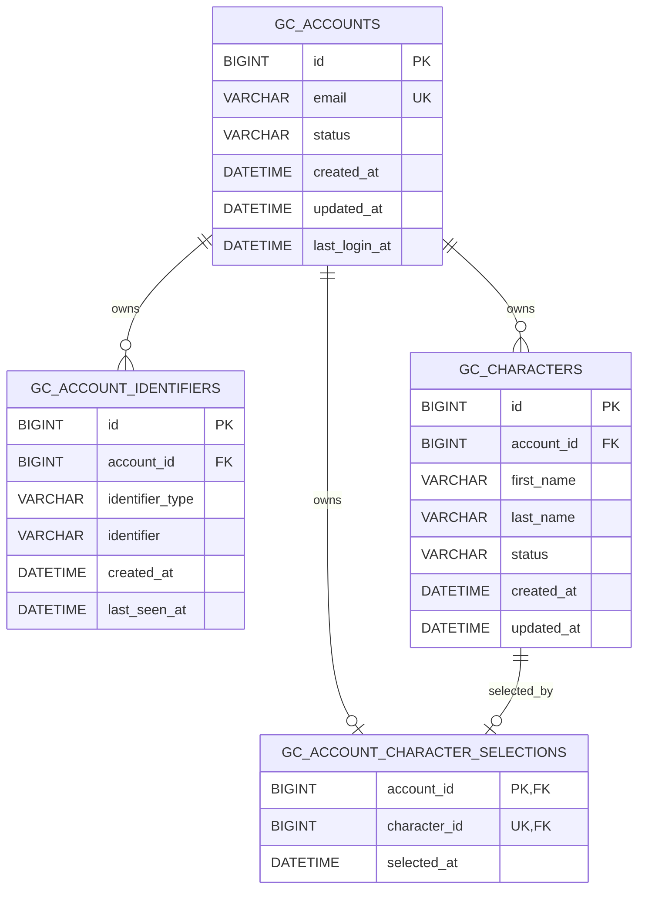

# gc_identity persistent identity design

Status: approved implementation design for `0.2.0-alpha`.

## Boundary

`gc_identity` owns accounts, trusted identifier links, character identity, and
online identity sessions. `oxmysql` transports parameterized SQL. MariaDB owns
persistent records. `gc_core` remains database-independent and is consumed only
through Public Core API v1.

```text
FiveM -> gc_core Public API v1 -> gc_identity -> oxmysql -> MariaDB
```

The production adapter never falls back to JSON when MariaDB is unavailable.
Startup remains degraded until connection health and every migration pass.

## Repository contract

The service calls one facade, `GCIdentityRepository`. The selected adapter owns
all storage details:

| Adapter | Purpose | Production fallback |
| --- | --- | --- |
| `oxmysql` | production persistence | none |
| `memory` | deterministic automated tests | not available at runtime |
| `json_legacy` | explicit one-time import source | never selected silently |

Read methods distinguish a missing domain record from a storage failure. A
missing account returns `GC-IDENTITY-ACCOUNT-NOT-FOUND`; an unavailable or failed
database returns a `GC-IDENTITY-DATABASE-*` code.

## Schema



`email` is nullable only for a legacy imported account. It is unique whenever
present. Such an account remains `registration_required` until the current
trusted identifier completes email registration.

`gc_identity_schema_migrations(version, description, applied_at)` records schema
history. Migrations have immutable ordered IDs, contain no destructive DDL in
this milestone, and are recorded only after every statement succeeds.

## Atomic writes

Registration uses one database transaction:

```text
validate untrusted email
  -> lock/check unique email and trusted identifier
  -> insert gc_accounts
  -> insert gc_account_identifiers with the new account ID
  -> commit
```

Character creation locks the account row, counts active characters, enforces the
configured limit, inserts once, and commits. Character selection updates only
when the character exists, is active, and belongs to the current account.

Every value originating outside static migration SQL uses `?` placeholders.

## Runtime state and cancellation

MariaDB is persistent authority. Only online-player account/character DTO data is
cached in a runtime identity session. Each session has a generation. After every
yielding database boundary, the service verifies that the same source/generation
still exists before changing state. Disconnect, resource stop, or replacement
cancels the stale result.

## Failure policy

1. Verify Core API compatibility and oxmysql resource state.
2. Probe MariaDB with a bounded retry policy.
3. Apply pending migrations in order.
4. Initialize the production repository.
5. Only then declare identity ready and recover online players.

Connection, query, or migration failures never mean `NOT_FOUND`, never create an
account, and never activate the JSON adapter. Operators fix MariaDB and restart
`gc_identity`; no hot infinite reconnect loop is created.

## Authentication policy

Primary authorization is the server-captured FiveM `license` from Core API v1.
Password authentication is **not enabled**. No password field is collected and
no placeholder hashing scheme is implemented. Email is an account contact/name
field in this milestone; it is not claimed to be verified.
