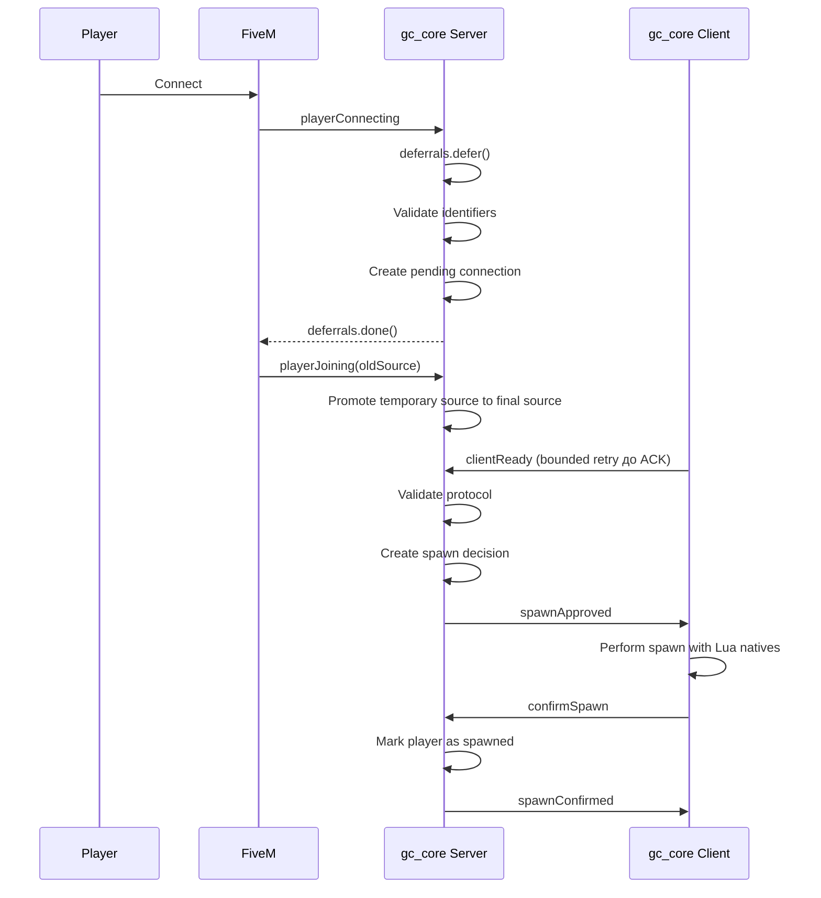

# Поток подключения / Connection Flow

## Уровень 1. Простыми словами

Когда игрок подключается к серверу, GreenCore проверяет его данные.
Если всё в порядке — игрок попадает на сервер.
Если нет — игрок получает сообщение об ошибке.

## Уровень 2. Техническое объяснение

GreenCore использует событие `playerConnecting` и корректный lifecycle deferrals:

```text
deferrals.defer()
   ↓
Wait(0)          — пропускаем минимум один tick
   ↓
deferrals.update(...)
   ↓
Wait(0)
   ↓
Validation
   ↓
deferrals.done()
```

**Важно:** во время `playerConnecting` `source` ещё не является окончательным
runtime Player ID. Поэтому создаётся **pending connection**, а не активная сессия.

Затем FiveM завершает подключение, и сервер получает событие `playerJoining`,
которое предоставляет финальный source. Pending connection мигрируется в активную
сессию:

```text
playerConnecting (temporary source = 60000)
   ↓
PendingConnection[60000]
   ↓
FiveM завершает подключение
   ↓
playerJoining(oldSource)
   ↓
final source = 12
   ↓
PendingConnection[60000] → ActiveSession[12]
```

## Уровень 3. Схема



## Уровень 4. Проверки

При подключении сервер проверяет:

1. Корректность `source`.
2. Существование имени игрока.
3. Непустоту имени.
4. Длину имени.
5. Наличие идентификаторов.
6. Наличие обязательного `license`.
7. Возможность использования `license2`.
8. Отсутствие дубликата подключения (в т.ч. в pending connection).
9. Не превышен ли тайм-аут deferrals.
10. Не остановлен ли ресурс.
11. Не заблокированы ли подключения.

## Pending Connection

Pending connection — это **временное** представление подключения. Она содержит:

```lua
{
    temporarySource = 60000,
    connectionId = 'gc:connection:...',
    playerName = 'Player',
    identifiers = { license = '...', license2 = '...' },
    primaryIdentifier = '...',
    state = 'connecting',
    connectedAt = ...,
    expiresAt = ...
}
```

Pending connection не считается активной игровой сессией.
Если `playerJoining` не произошёл в течение
`GCConfig.Connection.pendingConnectionLifetimeMs`, она удаляется.

## playerJoining

`playerJoining` связывает temporary source с final source и мигрирует
pending connection в активную сессию через `GCSessions.PromotePendingConnection`.
FiveM передаёт `oldSource` строкой, поэтому GreenCore нормализует его в число
до поиска pending connection.

Старая запись по temporary source удаляется, индексы обновляются на final source.

Callbacks `deferrals` принадлежат Cfx runtime. GreenCore не захватывает их в
`SetTimeout`, а успешный допуск вызывает `done()` без явного аргумента `nil`.
Синхронный deadline проверяется внутри исходной coroutine `playerConnecting`.

## Идемпотентный recovery после рестарта

Recovery не зависит от получения единственного `forceResync`:

```text
Client resource starts → clientReady (bounded retry до server ACK)
                         ↓
Server читает session state
joining   → normal ready flow
resyncing → authoritative ped check и recovery
spawned   → безопасный duplicate; повтор spawnConfirmed при валидном server ped
other     → stale/duplicate без state mutation
```

`forceResync` — bounded prompt с максимальным числом попыток и одним общим timeout.
Проактивный ACK-driven `clientReady` создаёт вторую сторону handshake. `resyncReady` сохранён
как backward-compatible alias. Duplicates не создают новую session, decision,
spawn, readiness thread и не продлевают timeout. Protocol mismatch не двигает
lifecycle.

Сервер сам проверяет `GetPlayerPed`, entity existence, owner и health.
Клиентский `isPedAlive` хранится только как `clientPedAliveHint` и никогда не
определяет server lifecycle state.

## Код обработчика

```lua
AddEventHandler('playerConnecting', function(playerName, setKickReason, deferrals)
    GCConnection.HandleConnecting(playerName, setKickReason, deferrals)
end)

AddEventHandler('playerJoining', function(oldSource)
    GCConnection.HandleJoining(oldSource)
end)
```

## Следующий шаг

Перейдите к [Сессии игрока](05-player-session.md).
