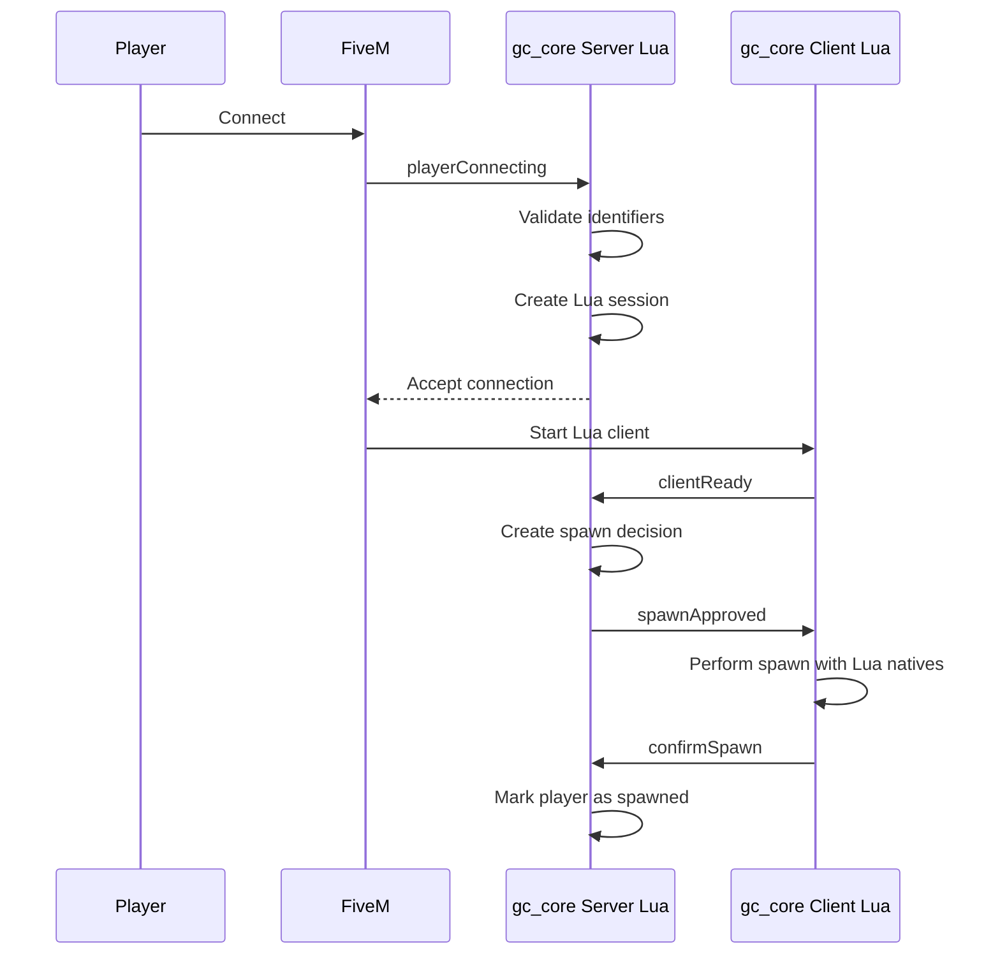

# Поток подключения / Connection Flow

## Уровень 1. Простыми словами

Когда игрок подключается к серверу, GreenCore проверяет его данные.
Если всё в порядке — игрок попадает на сервер.
Если нет — игрок получает сообщение об ошибке.

## Уровень 2. Техническое объяснение

GreenCore использует событие `playerConnecting` и deferrals.
Deferrals позволяют отложить решение о подключении до завершения проверки.

## Уровень 3. Схема



## Уровень 4. Проверки

При подключении сервер проверяет:

1. Корректность `source`.
2. Существование имени игрока.
3. Непустоту имени.
4. Длину имени.
5. Наличие идентификаторов.
6. Наличие обязательного `license`.
7. Возможность использования `license2`.
8. Отсутствие дубликата подключения.
9. Отсутствие зависшего старого подключения.
10. Не превышен ли тайм-аут.
11. Не остановлен ли ресурс.
12. Не заблокированы ли подключения.

## Код обработчика

```lua
AddEventHandler('playerConnecting', function(playerName, setKickReason, deferrals)
    GCConnection.HandleConnecting(playerName, setKickReason, deferrals)
end)
```

## Следующий шаг

Перейдите к [Сессии игрока](05-player-session.md).