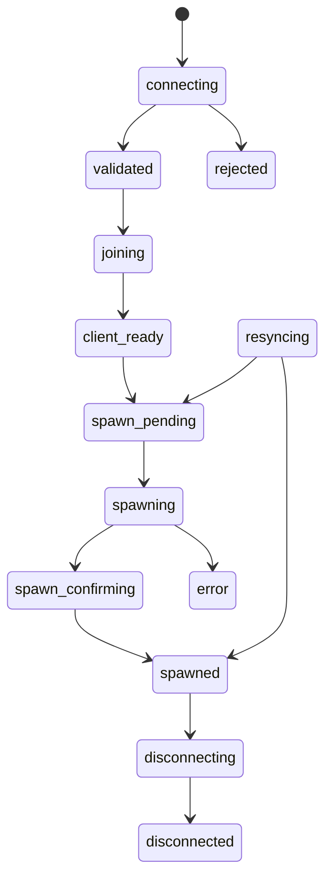

# Состояния игрока / Player States

## Уровень 1. Простыми словами

Состояние — это этап, на котором находится игрок.
GreenCore следит, чтобы игрок проходил этапы в правильном порядке.

## Уровень 2. Техническое объяснение

Каждое состояние хранится в сессии игрока.
Переходы между состояниями проверяются сервером.
Все вызовы `GCStates.Set` возвращают `success, errorCode`, которые вызывающие
стороны обязаны проверять.

## Таблица состояний

| Состояние          | RU                          | EN                             |
| ------------------ | --------------------------- | ------------------------------ |
| `connecting`       | Игрок подключается          | Player is connecting           |
| `validated`        | Проверка завершена          | Validation completed           |
| `joining`          | Игрок входит                | Player is joining              |
| `client_ready`     | Клиент готов                | Client is ready                |
| `spawn_pending`    | Спавн подготавливается      | Spawn is being prepared        |
| `spawning`         | Выполняется спавн           | Spawn is in progress           |
| `spawn_confirming` | Спавн подтверждается        | Spawn is being confirmed       |
| `spawned`          | Игрок появился              | Player has spawned             |
| `resyncing`        | Игрок синхронизируется      | Player is resynchronizing      |
| `disconnecting`    | Игрок отключается           | Player is disconnecting        |
| `disconnected`     | Игрок отключён              | Player disconnected            |
| `rejected`         | Подключение отклонено       | Connection rejected            |
| `error`            | Произошла ошибка            | An error occurred              |

## Основной lifecycle

```text
connecting
   ↓
validated
   ↓
joining
   ↓
client_ready
   ↓
spawn_pending
   ↓
spawning
   ↓
spawn_confirming
   ↓
spawned
```

## Recovery после рестарта

```text
resyncing → spawned          (игрок уже в мире)
resyncing → spawn_pending    (нужен повторный спавн)
```

## Отключение из любого состояния

Игрок способен отключиться из **любого активного** состояния:

```text
connecting → disconnecting
validated → disconnecting
joining → disconnecting
client_ready → disconnecting
spawn_pending → disconnecting
spawning → disconnecting
spawn_confirming → disconnecting
spawned → disconnecting
resyncing → disconnecting
error → disconnecting
```

Затем:

```text
disconnecting → disconnected
```

Нельзя предполагать, что игрок отключается только после успешного спавна.

## Дополнительные переходы

```text
connecting → rejected
validated → rejected
joining → error
client_ready → error
spawn_pending → error
spawning → error
spawn_confirming → error
resyncing → error
```

## Запрещённые переходы

```text
connecting → spawned
validated → spawned
client_ready → connecting
spawned → spawn_pending
spawned → spawn_confirming
disconnected → spawned
```

## Схема



## Методы сервиса состояний

| Метод | Назначение |
| ----- | ---------- |
| `GCStates.CanTransition` | Проверяет разрешённость перехода |
| `GCStates.Set` | Устанавливает новое состояние |
| `GCStates.Get` | Возвращает текущее состояние |
| `GCStates.Is` | Проверяет, находится ли игрок в состоянии |
| `GCStates.GetAllowedTransitions` | Возвращает разрешённые переходы |
| `GCStates.IsActiveState` | Проверяет, является ли состояние активным |

## Уровень 3. Пример Lua-кода

```lua
local success, errorCode = GCStates.Set(
    playerSource,
    'client_ready',
    'client_reported_ready'
)

if not success then
    GCLogger.Warn('GC-STATE-100', 'State transition failed', {
        source = playerSource,
        errorCode = errorCode
    })
end
```

Все критические переходы должны проверять результат, чтобы удаление игрока
никогда не оставляло зависшую Lua-сессию.

## Следующий шаг

Перейдите к [Потоку спавна](07-spawn-flow.md).