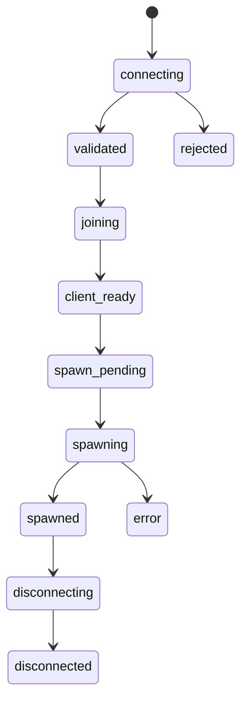

# Состояния игрока / Player States

## Уровень 1. Простыми словами

Состояние — это этап, на котором находится игрок.
GreenCore следит, чтобы игрок проходил этапы в правильном порядке.

## Уровень 2. Техническое объяснение

Каждое состояние хранится в сессии игрока.
Переходы между состояниями проверяются сервером.

## Таблица состояний

| Состояние       | RU                     | EN                      |
| --------------- | ---------------------- | ----------------------- |
| `connecting`    | Игрок подключается     | Player is connecting    |
| `validated`     | Проверка завершена     | Validation completed    |
| `joining`       | Игрок входит           | Player is joining       |
| `client_ready`  | Клиент готов           | Client is ready         |
| `spawn_pending` | Спавн подготавливается | Spawn is being prepared |
| `spawning`      | Выполняется спавн      | Spawn is in progress    |
| `spawned`       | Игрок появился         | Player has spawned      |
| `disconnecting` | Игрок отключается      | Player is disconnecting |
| `disconnected`  | Игрок отключён         | Player disconnected     |
| `rejected`      | Подключение отклонено  | Connection rejected     |
| `error`         | Произошла ошибка       | An error occurred       |

## Разрешённые переходы

```text
connecting → validated
validated → joining
joining → client_ready
client_ready → spawn_pending
spawn_pending → spawning
spawning → spawned
spawned → disconnecting
disconnecting → disconnected
```

## Дополнительные переходы

```text
connecting → rejected
validated → rejected
joining → error
client_ready → error
spawn_pending → error
spawning → error
error → disconnecting
```

## Запрещённые переходы

```text
connecting → spawned
validated → spawned
client_ready → connecting
spawned → spawn_pending
disconnected → spawned
```

## Схема



## Методы сервиса состояний

| Метод | Назначение |
| ----- | ---------- |
| `GCStates.CanTransition` | Проверяет разрешённость перехода |
| `GCStates.Set` | Устанавливает новое состояние |
| `GCStates.Get` | Возвращает текущее состояние |
| `GCStates.Is` | Проверяет, находится ли игрок в состоянии |
| `GCStates.GetAllowedTransitions` | Возвращает разрешённые переходы |

## Уровень 3. Пример Lua-кода

```lua
local success, errorCode = GCStates.Set(
    playerSource,
    'client_ready',
    'client_reported_ready'
)

if not success then
    print('State transition failed: ' .. tostring(errorCode))
end
```

## Следующий шаг

Перейдите к [Потоку спавна](07-spawn-flow.md).