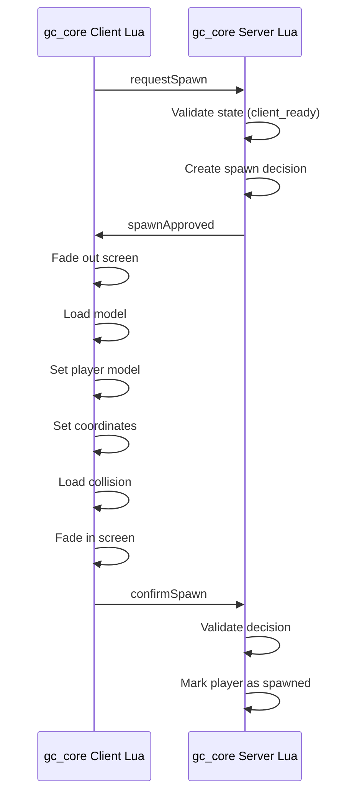

# Поток спавна / Spawn Flow

## Уровень 1. Простыми словами

Когда клиент готов, сервер решает, где и с какой моделью появится игрок.
Клиент выполняет спавн и сообщает серверу результат.

## Уровень 2. Техническое объяснение

Сервер создаёт объект `spawnDecision` с координатами, моделью и сроком действия.
Клиент получает решение и выполняет спавн через стандартные natives.

## Схема



## Серверное решение о спавне

```lua
local spawnDecision = {
    id = 'gc:spawn:generated-id',
    sessionId = 'gc:session:generated-id',
    source = playerSource,

    position = {
        x = -1037.65,
        y = -2737.72,
        z = 20.17,
        heading = 329.0
    },

    model = `mp_m_freemode_01`,

    createdAt = os.time(),
    expiresAt = os.time() + 30,

    confirmed = false,
    consumed = false
}
```

Решение создаёт **только сервер**.

Клиент не может:

- выбирать координаты;
- выбирать модель;
- создавать Decision ID;
- продлевать срок действия;
- подтверждать чужое решение.

## Клиентский спавн

Клиент выполняет:

1. Получение решения сервера.
2. Проверку payload.
3. Затемнение экрана.
4. Заморозку ped.
5. Загрузку модели.
6. Установку модели.
7. Установку координат.
8. Загрузку коллизии.
9. Очистку задач ped.
10. Разморозку ped.
11. Возврат изображения.
12. Отправку подтверждения.

## Используемые natives

```lua
RequestModel(modelHash)
HasModelLoaded(modelHash)
SetPlayerModel(PlayerId(), modelHash)
SetModelAsNoLongerNeeded(modelHash)
SetEntityCoordsNoOffset(...)
SetEntityHeading(...)
RequestCollisionAtCoord(...)
HasCollisionLoadedAroundEntity(...)
FreezeEntityPosition(...)
```

## Следующий шаг

Перейдите к [Конфигурации](08-configuration.md).