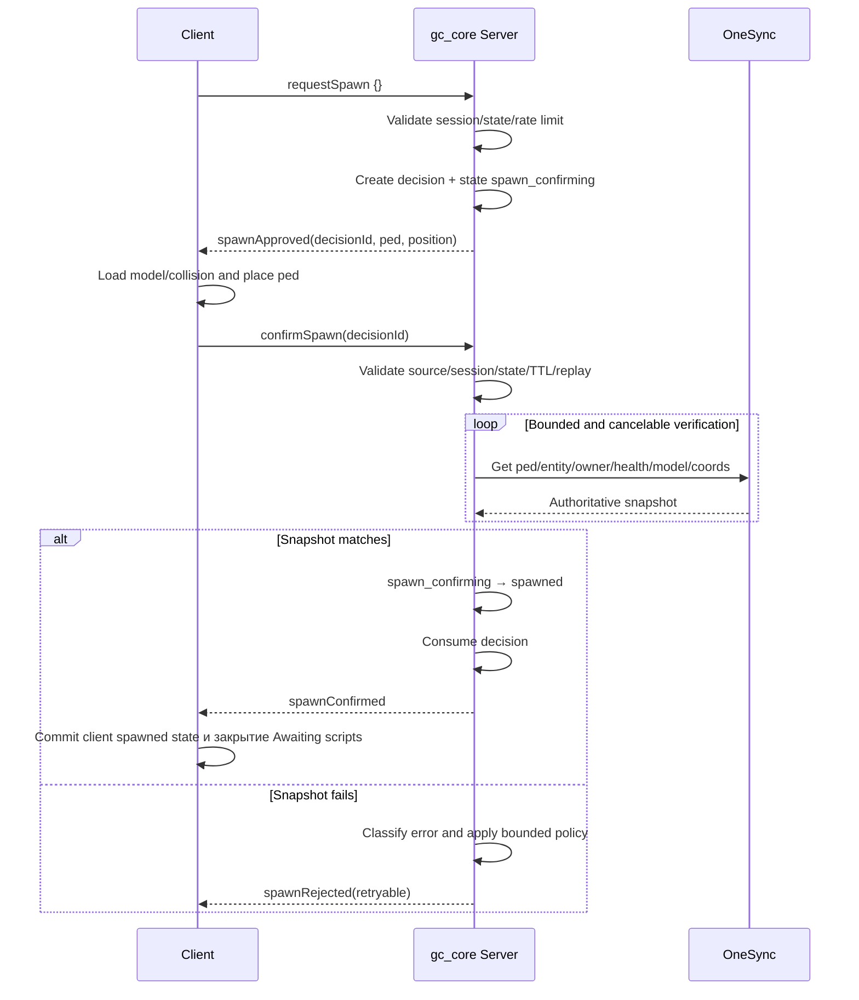

# Поток спавна

## Простыми словами

Клиент просит. Сервер проверяет, выбирает PED и координаты, создаёт одноразовое
решение. Клиент исполняет его. Затем сервер читает реальную OneSync entity и только
при совпадении фиксирует состояние `spawned`.

## Схема



Внутренний переход в `spawn_confirming` завершается **до** отправки
`spawnApproved`, поэтому быстрый ответ клиента не обгоняет server state.

Клиент закрывает оба слоя загрузки FiveM только после этого валидного
server-origin `spawnConfirmed`. Завершение идемпотентно: recovery или duplicate
confirmation не вызывают loading-screen natives повторно.

## Серверная проверка

`confirmSpawn` содержит только `decisionId` и ничего не доказывает. Production
`GCSpawn.Confirm` проверяет:

1. решение существует, не истекло и не использовано;
2. source и session владеют решением;
3. lifecycle равен `spawn_confirming`;
4. `GetPlayerPed` и `DoesEntityExist`;
5. `NetworkGetEntityOwner(ped) == playerSource`;
6. `GetEntityHealth` не ниже configured minimum;
7. `GetEntityModel` совпадает с выбранным сервером PED;
8. `GetEntityCoords` находится в пределах tolerance;
9. после native boundary всё ещё существуют те же session/decision.

Verification прекращается при disconnect, замене session/decision, истечении
decision, остановке ресурса, несовместимой смене state, лимите попыток или timeout.

## Retry policy

Каждый retry потребляет старый ID и создаёт новое решение. PED меняется только при
MODEL failure.

| Категория | Примеры | Действие |
| --- | --- | --- |
| MODEL | invalid/load timeout/model mismatch | new decision, другой PED |
| ENTITY | missing/dead entity | limited new decision, тот же PED |
| COLLISION | collision timeout | limited same PED |
| POSITION | replication/mismatch | bounded verification, затем limited same PED |
| VERIFICATION/TIMEOUT | snapshot/verification timeout | limited same PED |
| DECISION | unknown/expired/consumed/source mismatch | reject без spawn retry |
| SESSION | session mismatch/change/state error | reject и cancel transaction |
| SECURITY | wrong network owner | reject и security log |
| UNKNOWN | незарегистрированный code | fail closed |

Лимиты `maxTotalAttempts`, `maxSamePedRetries`, `maxDifferentPedRetries` и
`verification.maxAttempts` находятся в `config/spawn.lua`. Per-player frame loop
не создаётся.

## Пример клиентского исполнения

```lua
-- Клиент отправляет только ID неизменяемого server decision.
TriggerServerEvent('gc_core:server:confirmSpawn', {
    decisionId = payload.decisionId
})
```

Client coordinates, PED model, alive state и confirmation никогда не считаются
authoritative truth.

Перейдите к [конфигурации](08-configuration.md).
