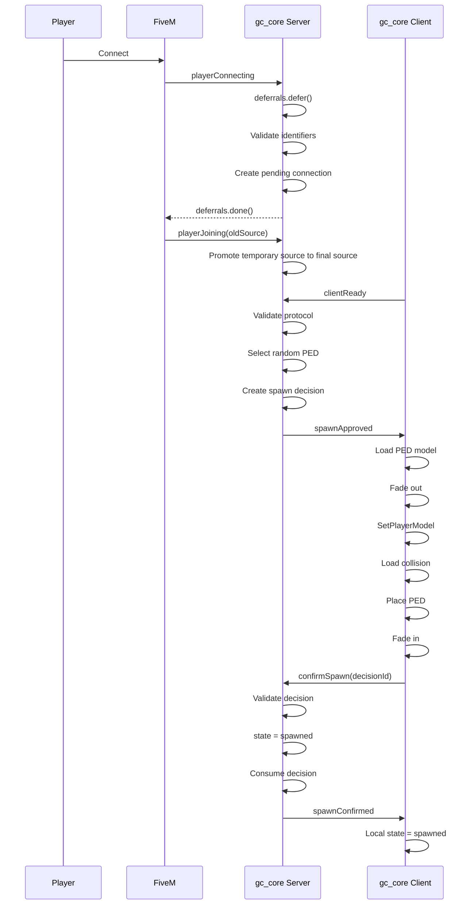

# Поток спавна / Spawn Flow

## Уровень 1. Простыми словами

Когда клиент готов, **сервер** решает, где и с какой моделью появится игрок.
Сервер случайно выбирает модель PED из белого списка.
Клиент выполняет спавн, но НЕ считает его завершённым самостоятельно.
Только сервер подтверждает спавн (`spawnConfirmed`).

## Уровень 2. Техническое объяснение

1. Сервер выбирает модель PED через `GCPedProvider.Resolve`.
2. Сервер выбирает точку через `GCSpawnLocationProvider.Resolve`.
3. Сервер создаёт `spawnDecision`, содержащий `ped = { name, hash }`.
4. Клиент получает `spawnApproved`, загружает модель и выполняет спавн.
5. Клиент переходит в состояние `spawn_confirming` и отправляет `confirmSpawn`.
6. Сервер валидирует решение атомарно и переводит игрока в `spawned`.
7. Сервер отправляет `spawnConfirmed`, и только после этого клиент ставит `spawned=true`.

## Схема / Diagram



## Серверное решение о спавне

```lua
local spawnDecision = {
    id = 'gc:spawn:generated-id',
    sessionId = 'gc:session:generated-id',
    source = playerSource,

    position = {
        x = -1037.65,
        y = -2737.72,
        z = 20.17,
        heading = 329.0
    },

    ped = {
        name = 'a_m_y_business_01',
        hash = 0x...
    },

    createdAt = os.time(),
    expiresAt = os.time() + 30,

    confirmed = false,
    consumed = false
}
```

Решение создаёт **только сервер**, и случайный PED выбирается ровно один раз.

Клиент не может:

- выбирать координаты;
- выбирать модель PED;
- создавать Decision ID;
- продлевать срок действия;
- подтверждать чужое решение.

## Атомарное подтверждение

Порядок подтверждения строгий:

```text
VALIDATE
   ↓
STATE TRANSITION (spawn_confirming → spawned)
   ↓
MARK DECISION CONFIRMED
   ↓
MARK DECISION CONSUMED
   ↓
REMOVE ACTIVE DECISION
   ↓
CLEAR session.spawnDecision
   ↓
SEND spawnConfirmed
```

Если переход состояния не удался, решение **остаётся активным** для retry/timeout
и не потребляется преждевременно.

## Клиентский спавн

Клиент выполняет:

1. Получение решения сервера.
2. Проверку payload (`GCValidation.SpawnApproved`).
3. Затемнение экрана с тайм-аутом.
4. Проверку модели: `IsModelInCdimage`, `IsModelValid`, `IsModelAPed`.
5. Загрузку модели с тайм-аутом.
6. `SetPlayerModel`.
7. Повторное получение ped (старый handle устарел).
8. Установку серверных координат.
9. Загрузку коллизии с тайм-аутом.
10. Очистку задач ped.
11. Разморозку ped и возврат управления.
12. Переход в `spawn_confirming` (НЕ `spawned`).
13. Отправку `confirmSpawn(decisionId)`.

Клиент **никогда** не устанавливает `spawned=true` сам. Это делает только сервер
через событие `spawnConfirmed`.

## Используемые natives

```lua
IsModelInCdimage(modelHash)
IsModelValid(modelHash)
IsModelAPed(modelHash)
RequestModel(modelHash)
HasModelLoaded(modelHash)
SetPlayerModel(PlayerId(), modelHash)
SetModelAsNoLongerNeeded(modelHash)
SetEntityCoordsNoOffset(...)
SetEntityHeading(...)
RequestCollisionAtCoord(...)
HasCollisionLoadedAroundEntity(...)
FreezeEntityPosition(...)
DoScreenFadeOut(...)
DoScreenFadeIn(...)
```

## Случайный PED

Подробнее см. [Случайный выбор PED](random-ped-spawn.md).

## Следующий шаг

Перейдите к [Конфигурации](08-configuration.md).