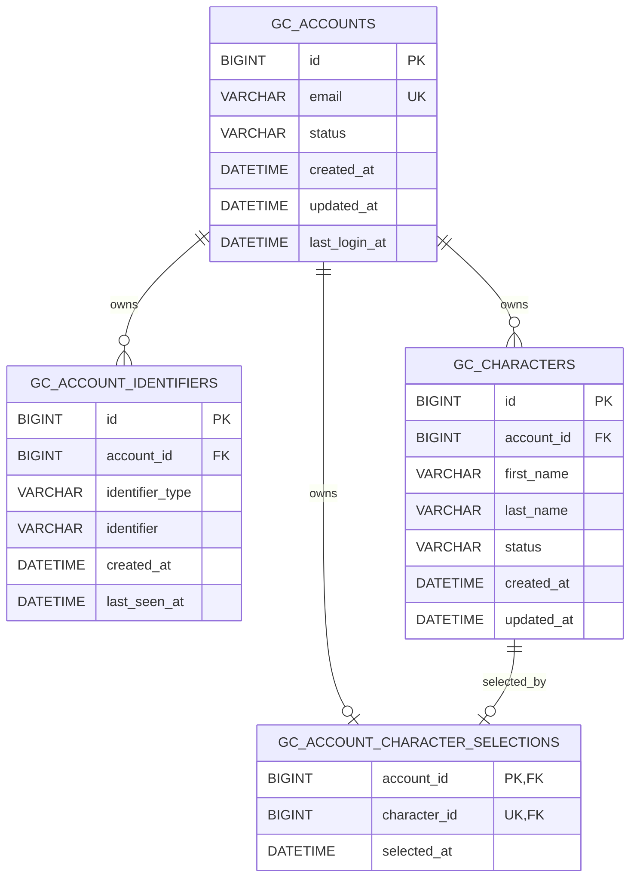

# Проект persistent identity для gc_identity

Статус: утверждённый implementation design для `0.2.0-alpha`.

## Граница ответственности

`gc_identity` владеет аккаунтами, trusted identifier links, персонажами и online
identity sessions. `oxmysql` передаёт параметризованный SQL. MariaDB хранит
постоянные записи. `gc_core` не зависит от БД и используется только через Public
Core API v1.

```text
FiveM -> gc_core Public API v1 -> gc_identity -> oxmysql -> MariaDB
```

Production adapter никогда не переключается на JSON при недоступной MariaDB.
Модуль остаётся degraded, пока не пройдут health check и все migrations.

## Repository contract

Service обращается к одному facade `GCIdentityRepository`. Деталями storage
владеет выбранный adapter:

| Adapter | Назначение | Production fallback |
| --- | --- | --- |
| `oxmysql` | production persistence | отсутствует |
| `memory` | детерминированные automated tests | недоступен в runtime |
| `json_legacy` | явный одноразовый источник импорта | не выбирается молча |

Read methods различают отсутствие domain record и ошибку storage. Отсутствующий
аккаунт возвращает `GC-IDENTITY-ACCOUNT-NOT-FOUND`, а недоступная/сломанная БД —
код `GC-IDENTITY-DATABASE-*`.

## Схема



`email` допускает `NULL` только у импортированного legacy account. Для остальных
записей он уникален. Legacy account остаётся в `registration_required`, пока
текущий trusted identifier не завершит регистрацию email.

История хранится в
`gc_identity_schema_migrations(version, description, applied_at)`. Migration IDs
неизменяемы и упорядочены; destructive DDL в этом milestone нет. Версия
записывается только после выполнения всех statements.

## Атомарные записи

Регистрация выполняется одной database transaction:

```text
validate untrusted email
  -> lock/check unique email и trusted identifier
  -> insert gc_accounts
  -> insert gc_account_identifiers с новым account ID
  -> commit
```

Создание персонажа блокирует account row, считает активных персонажей, проверяет
configured limit, вставляет одну запись и делает commit. Selection меняется,
только если character существует, active и принадлежит текущему account.

Все внешние значения передаются через placeholders `?`.

## Runtime state и cancellation

MariaDB — persistent authority. В runtime identity session кэшируются только DTO
данные online player. У session есть generation. После каждой yielding DB boundary
service повторно проверяет тот же source/generation до изменения state.
Disconnect, stop или замена session отменяют stale result.

## Failure policy

1. Проверить Core API и состояние oxmysql.
2. Проверить MariaDB bounded retry policy.
3. Применить pending migrations по порядку.
4. Инициализировать production repository.
5. Только затем объявить identity ready и восстановить online players.

Connection/query/migration failure никогда не считается `NOT_FOUND`, не создаёт
account и не включает JSON adapter. После исправления MariaDB оператор
перезапускает `gc_identity`; infinite hot reconnect loop не создаётся.

## Authentication policy

Primary authorization использует server-captured FiveM `license` из Core API v1.
Password authentication **не включена**. Модуль не собирает password и не содержит
фиктивной hashing-схемы. Email в этом milestone — поле account, но он не
объявляется подтверждённым.
